# Finance Data Processing & Access Control

> A **full-stack financial management platform** built with a production-grade Node.js + TypeScript REST API backend and a modern React dashboard frontend. Features JWT authentication, role-based access control, interactive analytics, and a complete audit trail.

---

## 🌐 Live Demo

> **Hosted at:** [https://abc.onrender.com](https://abc.onrender.com)

| Credential | Value |
|------------|-------|
| Admin email | admin@finance.com |
| Analyst email | analyst@finance.com |
| Viewer email | viewer@finance.com |
| Password (all) | Password123 |

---

## Table of Contents

- [Screenshots](#screenshots)
- [Features](#features)
- [Architecture](#architecture)
- [Tech Stack](#tech-stack)
- [Project Structure](#project-structure)
- [Getting Started](#getting-started)
- [API Documentation](#api-documentation)
- [Authentication & RBAC](#authentication--rbac)
- [API Reference](#api-reference)
- [Data Models](#data-models)
- [Testing](#testing)
- [Design Decisions](#design-decisions)
- [Example API Calls](#example-api-calls)

---

## Screenshots

### Login Page
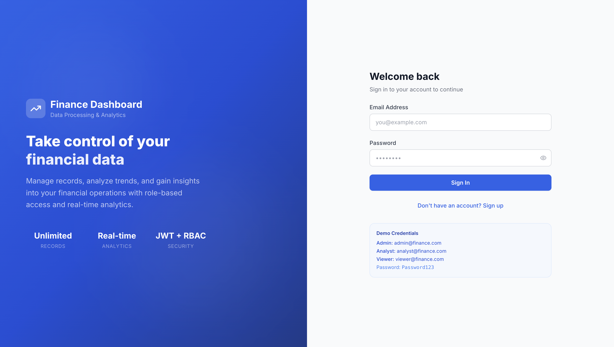

### Dashboard — Analytics Overview
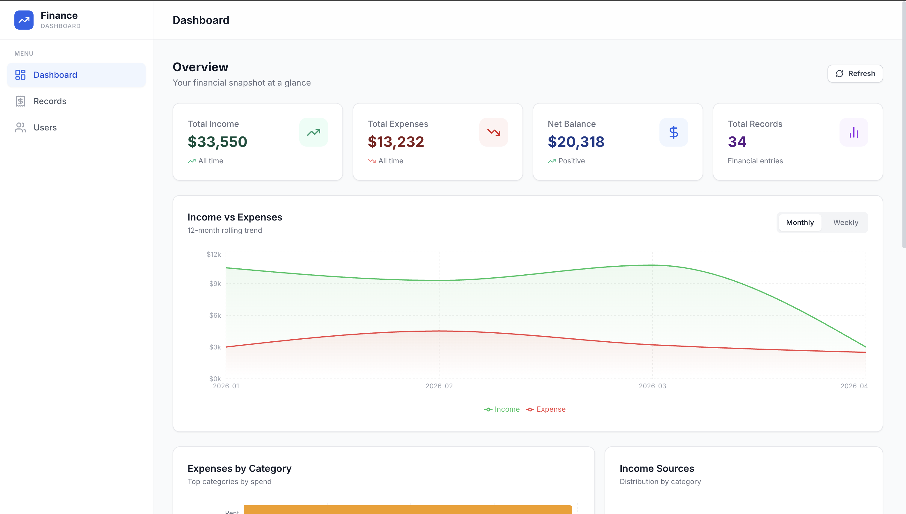

### Dashboard — Charts & Trends
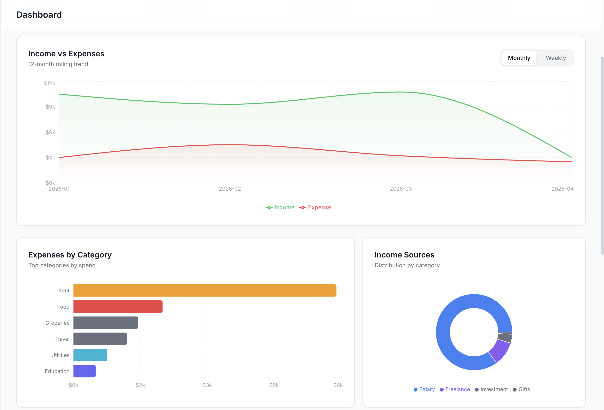

### Financial Records
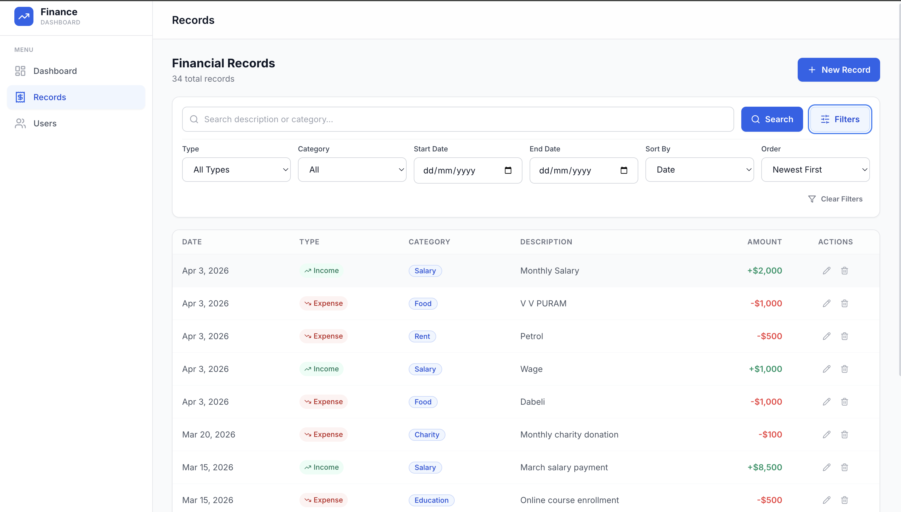

### Add Financial Record
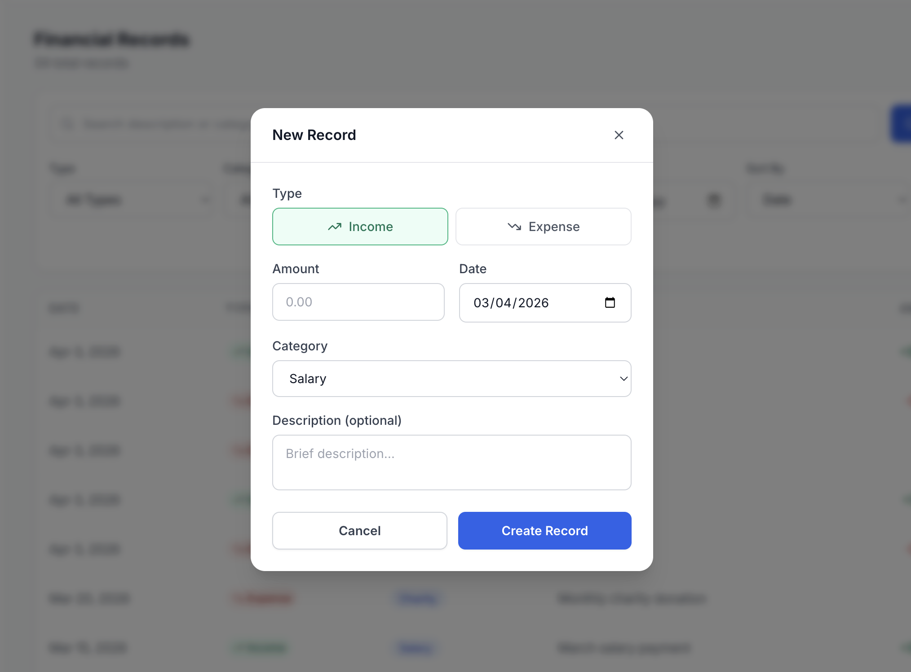

### User Management
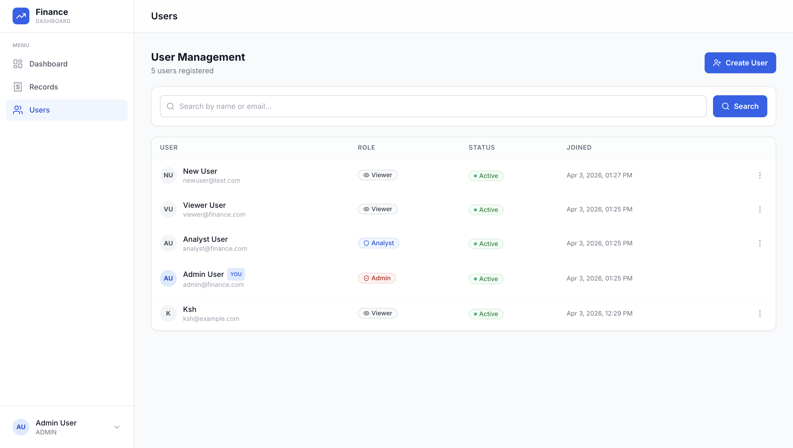

### Create New User
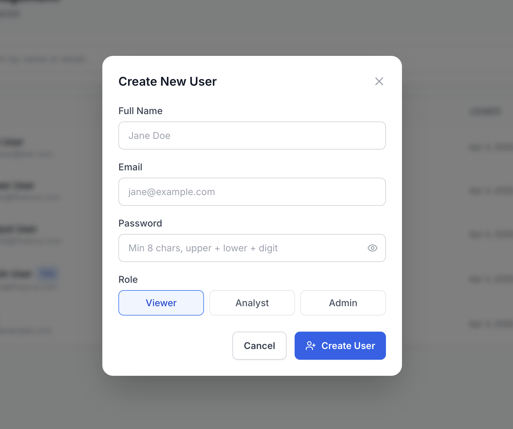

### Swagger API Documentation
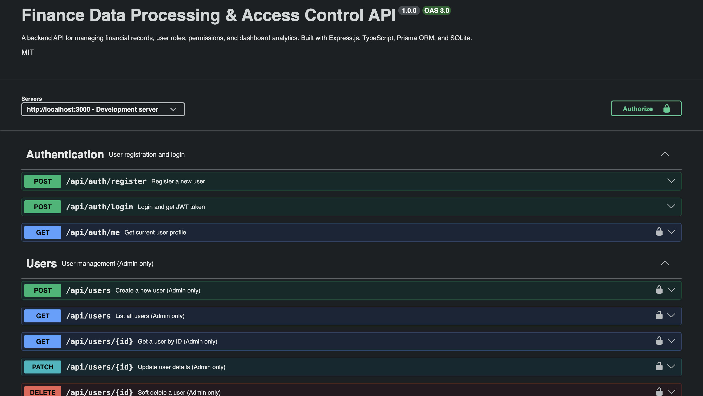

---

## Features

### Backend
- **JWT Authentication** — Secure stateless token-based login & registration
- **Role-Based Access Control (RBAC)** — Three-tier permission system: VIEWER → ANALYST → ADMIN
- **Financial Records CRUD** — Full create/read/update/delete with soft-delete
- **Advanced Filtering** — Filter records by type, category, date range, amount range, and full-text search
- **Pagination** — All list endpoints paginated with metadata (total, pages, hasNext, hasPrev)
- **Dashboard Analytics** — Income/expense summaries, category breakdowns, monthly & weekly trends
- **Audit Logging** — Every action (login, create, update, delete) logged with actor, entity, and change details
- **Input Validation** — All inputs validated with Zod schemas before reaching controllers
- **Rate Limiting** — Per-IP rate limiting (automatically skipped in development), stricter limits on auth endpoints in production
- **Swagger / OpenAPI 3.0** — Interactive API documentation at `/api-docs`
- **102 Automated Tests** — Unit + integration test coverage via Jest + Supertest

### Frontend Dashboard
- **Responsive UI** — Tailwind CSS, works on desktop and mobile
- **Interactive Charts** — Area chart (income vs expense trends), Bar chart (expenses by category), Pie chart (income sources) powered by Recharts
- **Summary Cards** — Total income, total expenses, net balance, transaction count
- **Record Management** — Browse, search, filter, and add records with a modal form
- **User Management** — Admin table with role/status editing, soft-delete, and create-new-user modal
- **Secure Auth Flow** — JWT stored in localStorage, auto-redirect on expiry, role-aware navigation
- **Admin-only Create User** — Modal with name, email, password (show/hide toggle), and role selector

---

## Architecture

### Request Lifecycle

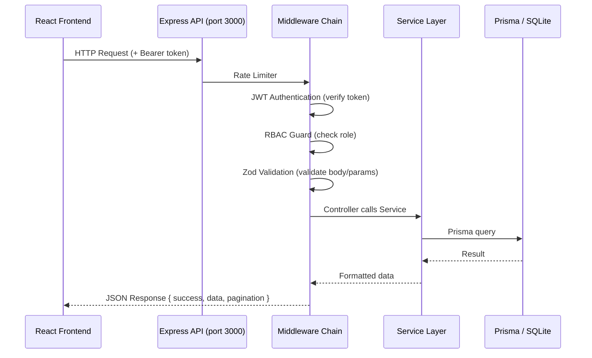

### Layered Architecture

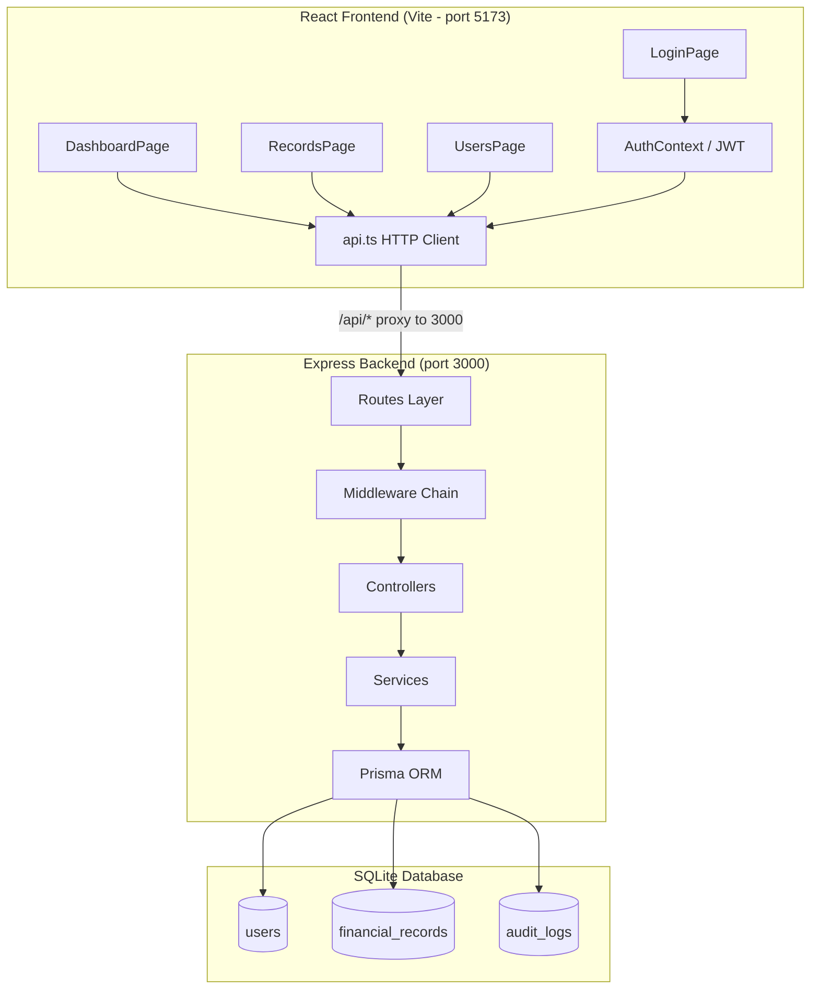

### RBAC Permission Matrix

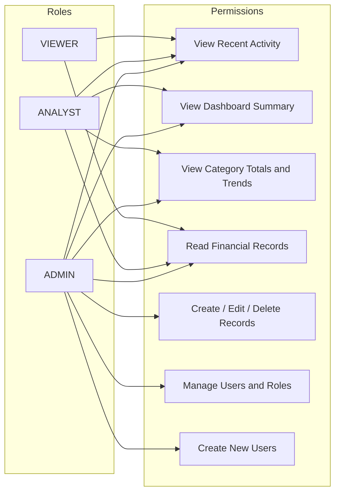

### Database Schema

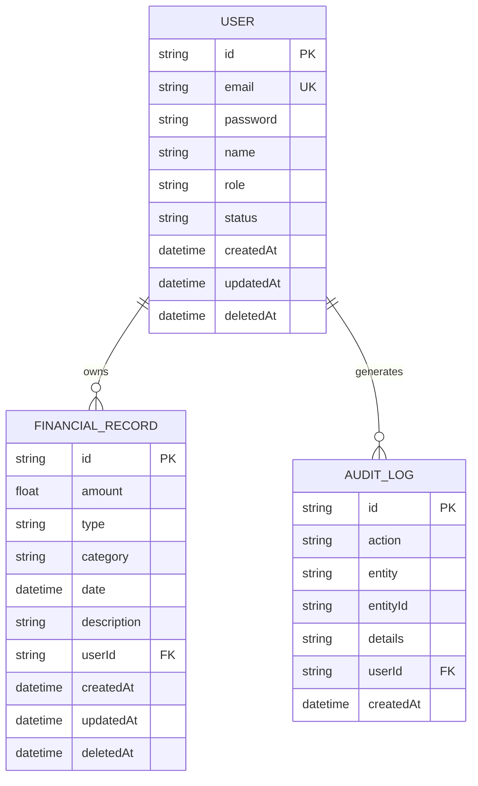

---

## Tech Stack

### Backend

| Layer | Technology | Version |
|-------|-----------|---------|
| Runtime | Node.js | >= 18 |
| Language | TypeScript (strict) | 5.x |
| Framework | Express.js | 5.x |
| ORM | Prisma | 5.x |
| Database | SQLite | — |
| Auth | JWT + bcryptjs | — |
| Validation | Zod | 4.x |
| Testing | Jest + Supertest | — |
| API Docs | Swagger / OpenAPI 3.0 | — |
| Security | Helmet + CORS + express-rate-limit | — |
| Logging | Morgan | — |

### Frontend

| Layer | Technology | Version |
|-------|-----------|---------|
| UI Library | React | 18.x |
| Language | TypeScript | 5.x |
| Build Tool | Vite | 6.x |
| Styling | Tailwind CSS | 3.x |
| Charts | Recharts | 2.x |
| Routing | React Router | 6.x |
| Icons | Lucide React | — |

---

## Project Structure

```
Finance_Data_Processing/
|
+-- src/                          # Backend source
|   +-- config/
|   |   +-- index.ts              # Environment configuration
|   |   +-- database.ts           # Prisma client singleton
|   |   +-- swagger.ts            # Swagger/OpenAPI spec
|   +-- controllers/
|   |   +-- auth.controller.ts
|   |   +-- user.controller.ts
|   |   +-- record.controller.ts
|   |   +-- dashboard.controller.ts
|   +-- middleware/
|   |   +-- auth.ts               # JWT authentication guard
|   |   +-- rbac.ts               # Role-based access control
|   |   +-- validate.ts           # Zod request validation
|   |   +-- rateLimiter.ts        # Rate limiting (dev-bypass)
|   |   +-- errorHandler.ts       # Global error + 404 handler
|   |   +-- index.ts
|   +-- routes/
|   |   +-- auth.routes.ts
|   |   +-- user.routes.ts
|   |   +-- record.routes.ts
|   |   +-- dashboard.routes.ts
|   |   +-- index.ts
|   +-- services/
|   |   +-- auth.service.ts       # Register, login, profile
|   |   +-- user.service.ts       # User CRUD + create user
|   |   +-- record.service.ts     # Financial record CRUD + filters
|   |   +-- dashboard.service.ts  # Aggregations + analytics
|   +-- types/index.ts
|   +-- utils/
|   |   +-- errors.ts             # Custom error classes
|   |   +-- response.ts           # Standardized response helpers
|   |   +-- validators.ts         # All Zod schemas
|   |   +-- seed.ts               # Database seed script
|   +-- app.ts                    # Express app setup + middleware
|   +-- server.ts                 # Server entry point
|
+-- frontend/                     # React frontend
|   +-- src/
|   |   +-- pages/
|   |   |   +-- LoginPage.tsx     # Login / register UI
|   |   |   +-- DashboardPage.tsx # Analytics + charts
|   |   |   +-- RecordsPage.tsx   # Financial records table
|   |   |   +-- UsersPage.tsx     # Admin user management
|   |   +-- components/
|   |   |   +-- Layout.tsx        # App shell, sidebar, top bar
|   |   +-- context/
|   |   |   +-- AuthContext.tsx   # Auth state + JWT management
|   |   +-- lib/
|   |   |   +-- api.ts            # All backend API calls
|   |   |   +-- storage.ts        # LocalStorage helpers
|   |   |   +-- utils.ts          # Formatting, class helpers
|   |   +-- types/index.ts
|   +-- vite.config.ts            # Vite config + /api proxy
|   +-- package.json
|
+-- prisma/
|   +-- schema.prisma             # Database schema
|   +-- migrations/               # SQL migration history
|
+-- tests/
|   +-- unit/
|   |   +-- errors.test.ts
|   |   +-- response.test.ts
|   |   +-- validators.test.ts
|   +-- integration/
|       +-- api.test.ts           # 50 full endpoint tests
|
+-- screenshots/                  # UI screenshots for README
+-- .env                          # Environment variables
+-- package.json                  # Backend scripts and deps
+-- tsconfig.json                 # Backend TypeScript config
+-- jest.config.js
```

---

## Getting Started

### Prerequisites

- **Node.js** >= 18.x
- **npm** >= 8.x

### 1. Clone & Install

```bash
git clone <your-repo-url>
cd Finance_Data_Processing

# Install backend dependencies
npm install

# Install frontend dependencies
npm run frontend:install
```

### 2. Configure Environment

The `.env` file is pre-configured for local development — no changes needed:

```dotenv
DATABASE_URL="file:./dev.db"
JWT_SECRET="finance-dashboard-super-secret-key-2026"
JWT_EXPIRES_IN="24h"
PORT=3000
NODE_ENV="development"
RATE_LIMIT_WINDOW_MS=900000
RATE_LIMIT_MAX_REQUESTS=100
```

> **Note:** Rate limiting is automatically **disabled in development** (`NODE_ENV=development`) so you will never hit request limits locally.

### 3. Set Up the Database

```bash
# Run migrations (creates dev.db)
npx prisma migrate dev

# Generate Prisma client
npx prisma generate

# Seed with sample users and 29 financial records
npm run seed
```

### 4. Start the Servers

Open **two terminals**:

```bash
# Terminal 1 — Backend API (http://localhost:3000)
npm run dev

# Terminal 2 — Frontend dev server (http://localhost:5173)
npm run frontend:dev
```

Then open **http://localhost:5173** in your browser.

### 5. Demo Credentials

All passwords are `Password123`:

| Role | Email | Access Level |
|------|-------|-------------|
| **Admin** | admin@finance.com | Full access — records, users, dashboard |
| **Analyst** | analyst@finance.com | Dashboard analytics + read records |
| **Viewer** | viewer@finance.com | Recent activity only |

### Available Scripts

| Script | Description |
|--------|------------|
| `npm run dev` | Start backend with hot reload (ts-node-dev) |
| `npm run build` | Compile TypeScript to JavaScript |
| `npm start` | Run compiled production build |
| `npm run seed` | Seed database with sample data |
| `npm test` | Run all 102 tests |
| `npm run test:coverage` | Run tests with coverage report |
| `npm run frontend:dev` | Start Vite frontend dev server |
| `npm run frontend:build` | Build frontend for production |
| `npm run db:studio` | Open Prisma Studio (visual DB browser) |
| `npm run db:reset` | Reset DB and re-seed |
| `npm run lint` | TypeScript type-check without compile |

---

## API Documentation

### Swagger UI

Start the backend and open: **http://localhost:3000/api-docs**

Interactive documentation with all endpoints, request/response schemas, and live test capability.

### Health Check

```
GET /health
-> { success: true, message: "...", environment: "development", timestamp: "..." }
```

---

## Authentication & RBAC

### Auth Flow

```
POST /api/auth/register  ->  { token, user }
POST /api/auth/login     ->  { token, user }
           |
           v
All subsequent requests:
  Authorization: Bearer <token>
```

### Role Permissions

| Role | Dashboard | Records (Read) | Records (Write) | User Management |
|------|:---------:|:--------------:|:---------------:|:---------------:|
| VIEWER | Recent activity only | Yes | No | No |
| ANALYST | Full analytics | Yes | No | No |
| ADMIN | Full analytics | Yes | Yes | Yes |

RBAC is enforced at the **middleware layer** — unauthorized requests are rejected before reaching any controller.

---

## API Reference

### Authentication

| Method | Endpoint | Description | Auth Required |
|--------|----------|-------------|:---:|
| POST | `/api/auth/register` | Register new user | No |
| POST | `/api/auth/login` | Login & get JWT | No |
| GET | `/api/auth/me` | Get current user profile | Yes |

### Users (Admin only)

| Method | Endpoint | Description |
|--------|----------|-------------|
| POST | `/api/users` | Create a new user |
| GET | `/api/users` | List users (paginated + search) |
| GET | `/api/users/:id` | Get user by ID |
| PATCH | `/api/users/:id` | Update user details |
| PATCH | `/api/users/:id/role` | Change user role / status |
| DELETE | `/api/users/:id` | Soft-delete user |

### Financial Records

| Method | Endpoint | Description | Min Role |
|--------|----------|-------------|----------|
| GET | `/api/records` | List records (paginated + filtered) | VIEWER |
| GET | `/api/records/:id` | Get single record | VIEWER |
| POST | `/api/records` | Create record | ADMIN |
| PATCH | `/api/records/:id` | Update record | ADMIN |
| DELETE | `/api/records/:id` | Soft-delete record | ADMIN |

#### Record Query Parameters

| Parameter | Type | Description |
|-----------|------|-------------|
| `page` | number | Page number (default: 1) |
| `limit` | number | Per page, max 100 (default: 10) |
| `type` | string | INCOME or EXPENSE |
| `category` | string | Filter by category |
| `startDate` | ISO 8601 | From date |
| `endDate` | ISO 8601 | To date |
| `search` | string | Full-text search (description + category) |
| `minAmount` | number | Minimum amount |
| `maxAmount` | number | Maximum amount |
| `sortBy` | string | date, amount, category, createdAt |
| `sortOrder` | string | asc or desc |

### Dashboard

| Method | Endpoint | Description | Min Role |
|--------|----------|-------------|----------|
| GET | `/api/dashboard/summary` | Total income, expenses, net balance, count | VIEWER |
| GET | `/api/dashboard/category-totals` | Category-wise breakdown | VIEWER |
| GET | `/api/dashboard/trends` | Monthly / weekly trends | VIEWER |
| GET | `/api/dashboard/recent-activity` | Latest records + audit log | VIEWER |

---

## Data Models

### User

| Field | Type | Notes |
|-------|------|-------|
| `id` | UUID | Primary key |
| `email` | String | Unique, indexed |
| `password` | String | bcrypt hashed (12 rounds), never returned in responses |
| `name` | String | Display name |
| `role` | Enum | VIEWER, ANALYST, ADMIN |
| `status` | Enum | ACTIVE, INACTIVE |
| `deletedAt` | DateTime? | Soft delete timestamp |

### Financial Record

| Field | Type | Notes |
|-------|------|-------|
| `id` | UUID | Primary key |
| `amount` | Float | Positive number |
| `type` | Enum | INCOME, EXPENSE |
| `category` | String | Salary, Rent, Food, Utilities, Entertainment, ... |
| `date` | DateTime | Transaction date |
| `description` | String? | Optional notes |
| `userId` | UUID | FK -> User |
| `deletedAt` | DateTime? | Soft delete timestamp |

### Audit Log

| Field | Type | Notes |
|-------|------|-------|
| `id` | UUID | Primary key |
| `action` | String | CREATE, UPDATE, DELETE, LOGIN, REGISTER |
| `entity` | String | User, FinancialRecord |
| `entityId` | String? | ID of affected entity |
| `details` | String? | JSON-serialized change details |
| `userId` | UUID | Who performed the action |

---

## Testing

```bash
# Run all 102 tests
npm test

# Verbose output
npm test -- --verbose

# With coverage report
npm run test:coverage
```

### Test Suite Breakdown

| Suite | Tests | Coverage |
|-------|:-----:|---------|
| Integration (API) | 50 | Auth, RBAC, CRUD, dashboard, error cases |
| Validators | 28 | All Zod schemas — valid + invalid inputs |
| Response Utils | 12 | Pagination helpers, response formatting |
| Error Classes | 12 | Custom error hierarchy and HTTP status codes |
| **Total** | **102** | |

### What Is Tested

- User registration, login, profile retrieval
- JWT authentication and token rejection
- RBAC — all three roles across all endpoints
- Full financial record CRUD lifecycle
- Record filtering, pagination, sorting, search
- Dashboard summary, category totals, trends, recent activity
- Soft delete (records and users disappear from queries)
- Input validation with precise error messages
- ADMIN self-protection (cannot delete own account or demote own role)
- 404 handling, conflict detection (duplicate email)

> **Test DB isolation:** Integration tests create users with `@test.com` emails and clean up only those rows — seeded development data is never touched.

---

## Design Decisions

| Decision | Rationale |
|----------|-----------|
| **SQLite over PostgreSQL** | Zero external dependencies. Switching to PostgreSQL requires one line change in `schema.prisma` |
| **JWT stateless auth** | Scales horizontally without session stores; natural fit for API-first design |
| **Soft deletes** | Preserves audit trail; `deletedAt` is indexed for query performance |
| **Audit log in DB** | Simple, queryable, zero extra infra. Production would use a dedicated logging service |
| **Zod v4 schemas** | TypeScript-first validation with inferred types; same schemas power both validation and OpenAPI docs |
| **Rate limiting dev-bypass** | `skip()` returns `true` when `NODE_ENV=development` so developers are never blocked locally |
| **12 bcrypt rounds** | ~250ms hash on modern hardware — strong security without perceptible latency |
| **Express v5** | Latest stable: improved async error propagation, better routing |
| **Vite proxy /api to port 3000** | Frontend calls `/api/*` naturally; no CORS issues, no hardcoded URLs |
| **Predefined categories** | Enforces data consistency; extending means adding to the Zod enum |

---

## Example API Calls

### Register

```bash
curl -X POST http://localhost:3000/api/auth/register \
  -H "Content-Type: application/json" \
  -d '{"email": "jane@example.com", "password": "SecurePass123", "name": "Jane Doe"}'
```

### Login

```bash
curl -X POST http://localhost:3000/api/auth/login \
  -H "Content-Type: application/json" \
  -d '{"email": "admin@finance.com", "password": "Password123"}'
```

### Create Financial Record (Admin)

```bash
curl -X POST http://localhost:3000/api/records \
  -H "Content-Type: application/json" \
  -H "Authorization: Bearer <token>" \
  -d '{"amount": 5000, "type": "INCOME", "category": "Salary", "date": "2026-04-01", "description": "April salary"}'
```

### List Records with Filters

```bash
curl "http://localhost:3000/api/records?type=EXPENSE&category=Food&page=1&limit=5&sortBy=amount&sortOrder=desc" \
  -H "Authorization: Bearer <token>"
```

### Dashboard Summary

```bash
curl http://localhost:3000/api/dashboard/summary \
  -H "Authorization: Bearer <token>"
```

### Monthly Trends

```bash
curl "http://localhost:3000/api/dashboard/trends?period=monthly&months=6" \
  -H "Authorization: Bearer <token>"
```

### Admin — Create User

```bash
curl -X POST http://localhost:3000/api/users \
  -H "Content-Type: application/json" \
  -H "Authorization: Bearer <token>" \
  -d '{"email": "newanalyst@company.com", "password": "Secure123", "name": "New Analyst", "role": "ANALYST"}'
```

---

## License

MIT
